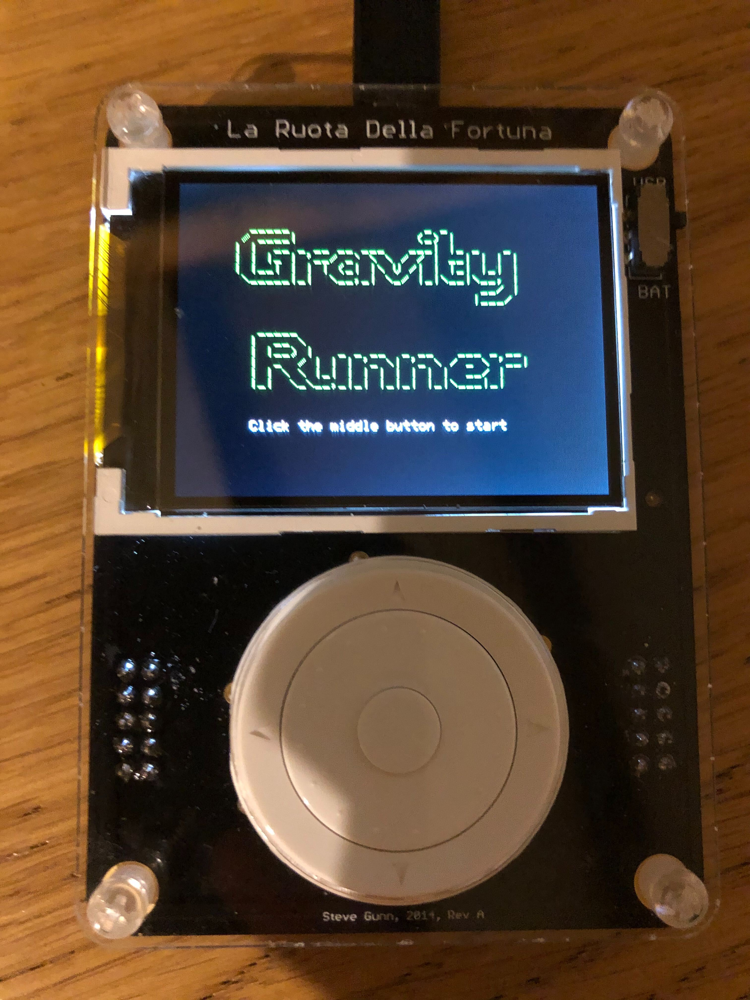

# Gravity Runner

A game built for the La Routa Della Fortuna board. The aim of the game is to avoid the obstacles for as long as possible by switching the direction that gravity is acting in. 




## Setup
1. Connect the La Fortuna board to your computer via USB.
2. Build and flash the application to the board using GNU Make:
```
make
```

## Usage
To play a game, click the middle button on the La Fortuna. The controls are simple -- click the middle button to switch the direction gravity is acting in.

## License
[MIT](https://choosealicense.com/licenses/mit/)
